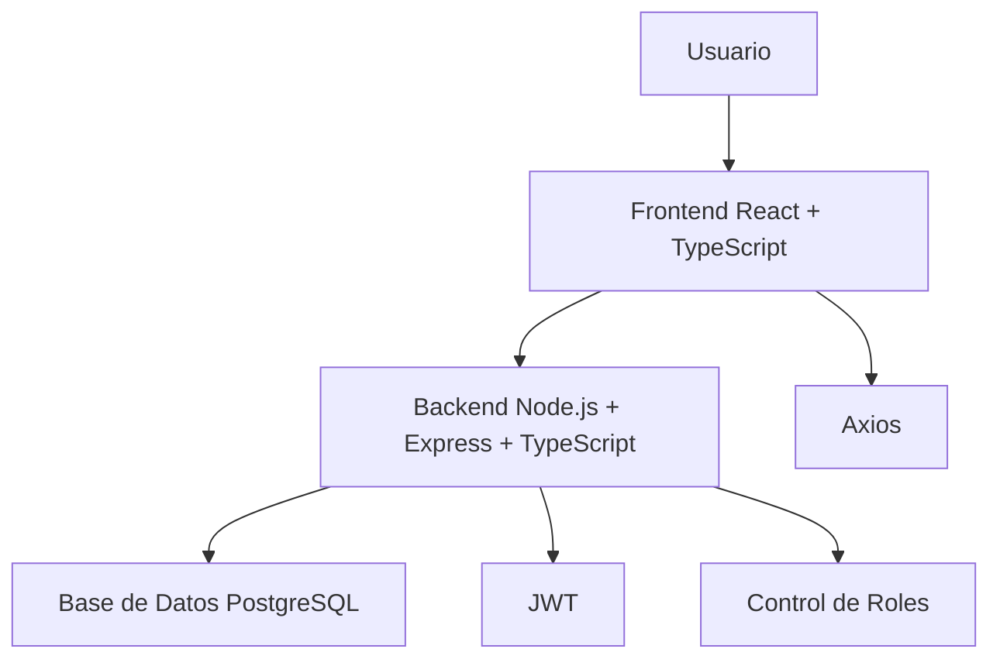
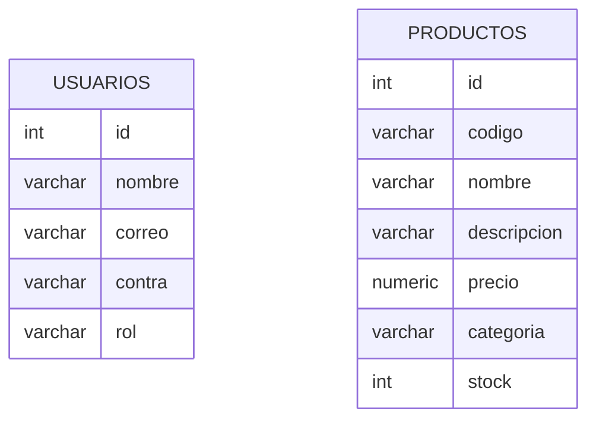
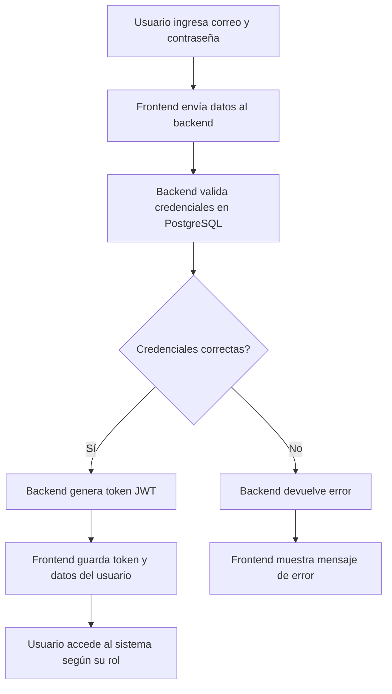
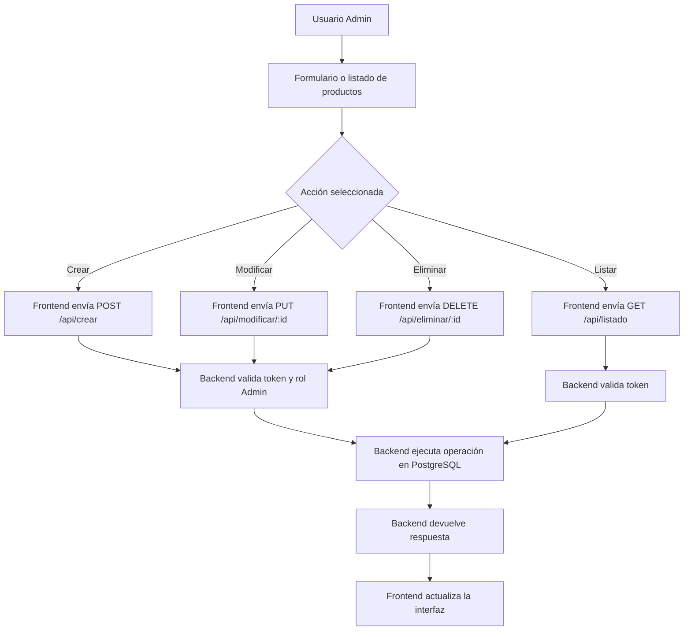
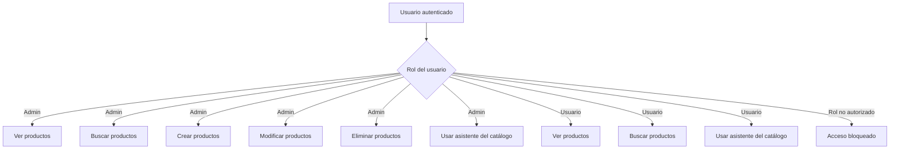
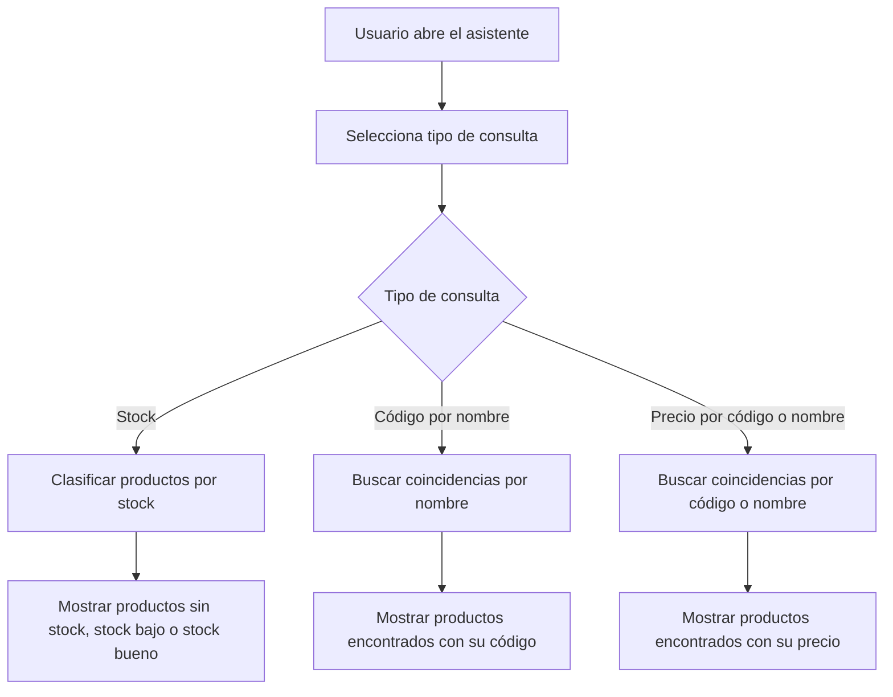

# Diagramas del Sistema

Este documento presenta los diagramas principales del sistema de gestión de productos.

Los diagramas ayudan a comprender la arquitectura, la base de datos, los flujos principales y el control de roles implementado en el proyecto.

---

## 1. Diagrama de arquitectura general

### Descripción

El usuario interactúa con el frontend desarrollado en React.
El frontend se comunica con el backend mediante Axios.
El backend procesa las peticiones, valida el token JWT, controla los roles y consulta la base de datos PostgreSQL.

---

## 2. Diagrama de base de datos

### Descripción

La base de datos contiene dos tablas principales:

* `usuarios`: almacena los datos de acceso y rol.
* `productos`: almacena la información del catálogo de productos.

Actualmente no existe una relación directa entre ambas tablas mediante llave foránea.

---

## 3. Flujo de inicio de sesión con JWT

### Descripción

El sistema valida las credenciales del usuario en la base de datos.
Si los datos son correctos, el backend genera un token JWT que se utiliza para acceder a las rutas protegidas.

---

## 4. Flujo CRUD de productos

### Descripción

El CRUD de productos permite listar, crear, modificar y eliminar productos.
Las acciones administrativas requieren que el usuario tenga rol `Admin`.

---

## 5. Diagrama de roles y permisos

### Descripción

El sistema maneja dos roles principales:

* `Admin`: puede administrar completamente el catálogo.
* `Usuario`: solo puede consultar productos y usar el asistente.

Cualquier rol no autorizado debe ser bloqueado por el sistema.

---

## 6. Flujo del asistente del catálogo

### Descripción

El asistente permite consultar información rápida del catálogo.
No utiliza una API externa de inteligencia artificial, sino lógica interna basada en los productos registrados.

---

## Conclusión

Los diagramas muestran la estructura principal del sistema, la comunicación entre sus partes, el modelo de datos, los flujos de uso y el control de roles.

Estos diagramas complementan la documentación técnica y facilitan la comprensión del proyecto.
